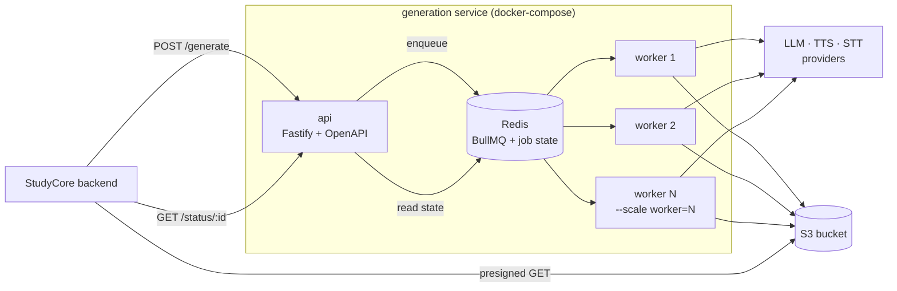
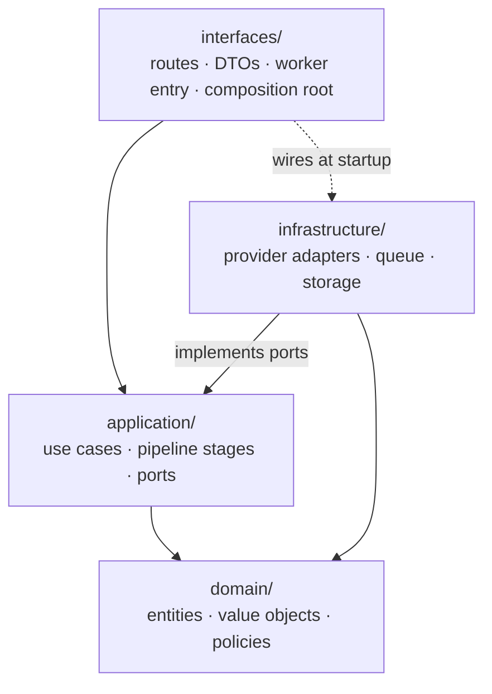
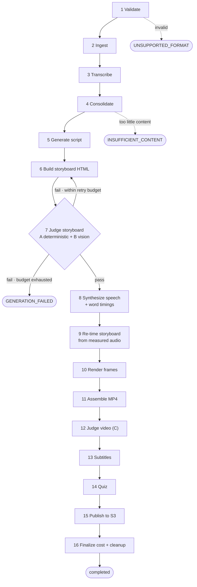
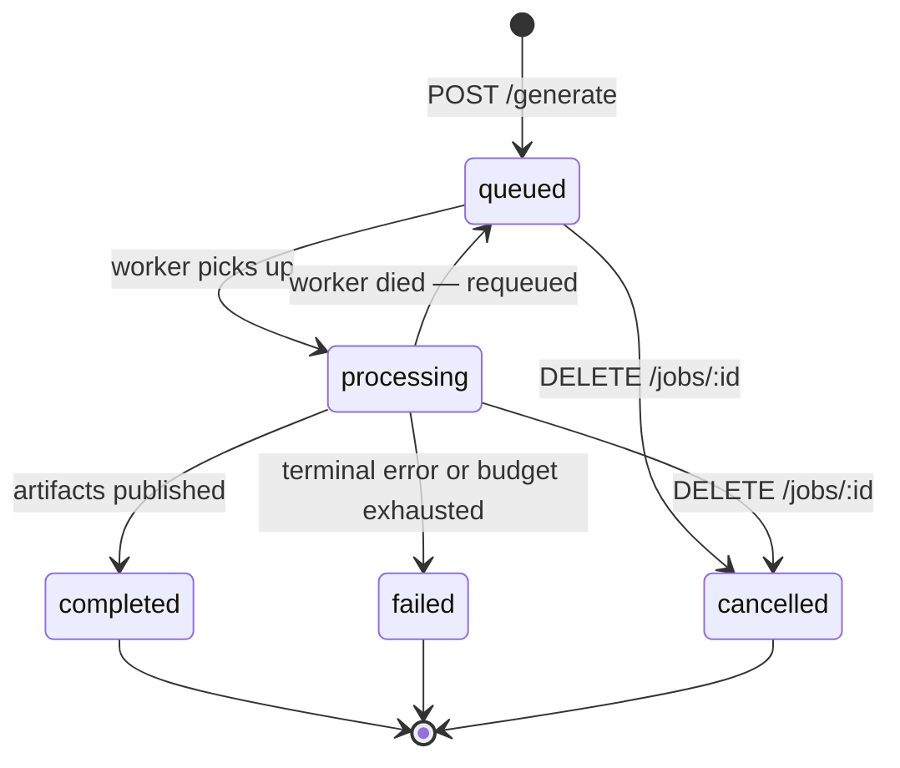
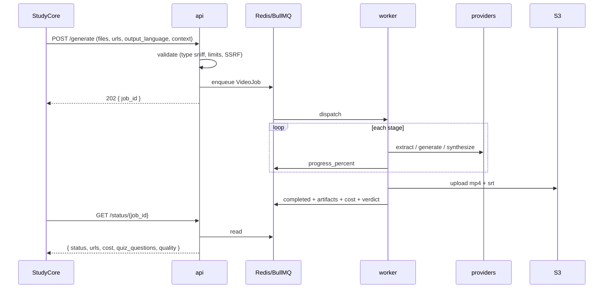

# StudyCore Whiteboard Video Microservice — Build Plan

## Context

`task-brief.md` commissions a greenfield, Dockerized TypeScript microservice that turns arbitrary
course material (PDF/DOCX/PPTX, images, URLs, YouTube, audio) into a whiteboard explainer video:
MP4 + `.SRT` on S3, plus quiz questions and per-job cost metadata, behind a job queue that sustains
20 concurrent generations.

The repo contains only the brief. This plan covers the full scope with no time-boxing — milestones
are ordered by dependency, not calendar. Decisions resolved with Saman are recorded in §1; the
remaining open items are in §2.

> ### Amendment — provider changes since this plan was written
>
> §1, §5 and §11 below record the original provider analysis and are kept intact
> as the reasoning record. Three decisions have since superseded parts of it:
>
> | Then | Now | Why |
> |---|---|---|
> | Gemini via **Vertex AI**, EU region | **OpenAI** (default) or **Gemini** first-party API, both by API key | The EU-residency requirement was relaxed to "US or EU", which was Vertex's entire justification. Without it, Vertex cost a GCP project and ADC setup for nothing. Driver removed. |
> | **Azure** Neural TTS | **ElevenLabs**, via `with-timestamps` | Azure signup was unavailable, and a decision was taken to use no Microsoft services. ElevenLabs returns per-character alignment, so the word-anchored timeline (§4) is unchanged. |
> | **Azure** STT fallback | **whisper.cpp** only | Removed with the rest of Azure. Transcription is now local or nothing, which is a stronger privacy position than the one it replaced. |
> | Fixed **twelve-component** vocabulary rendered by ffmpeg `drawtext` | Scenes author their own **HTML/CSS/SVG**, rendered in **Chromium** via Playwright | The ffmpeg renderer only ever implemented two of the twelve components; the rest rendered as a title above an empty board. Hand-coding eleven more templates would have grown the renderer and still capped the output at twelve shapes. The renderer now knows nothing about components. |
> | Quality judged from **markup** | Judged from a **screenshot** of the rendered scene | `judgeScene` always accepted `screenshotPaths` and was always given an empty array, so G4 (legibility) and G5 (consistency) were inferred from HTML. A new `visualPlan` stage designs the video first, and the judge compares the render against that brief. |
>
> §4's port boundaries are what made all of this additive: `SceneRendererPort`
> was already specified as "seek, screenshot, encode", so the new renderer is one
> adapter and one line at the composition root.
>
> The residency analysis in §5 therefore no longer describes the deployed system.
> Everything else in it — the port boundaries, the two-tier model split, the cost
> ceiling — still holds, because those were provider-agnostic by design: the
> swaps above touched the composition root and one adapter each.

Two of those decisions reshape the architecture versus a naive reading of the brief:
the LLM emits **HTML** (previewable in an iframe, cheap to test) rather than SVG or opaque scene
objects, and the pipeline gets an **automated judge stage** — the brief has no objective quality
gate whatsoever, routing every quality criterion to human review.

---

## 1. Decisions

Detail lives in the sections referenced; this is the scannable list.

### API contract
- **Sync REST, async generation.** `POST /generate` → `202 {job_id}`; caller polls `GET /status/{id}`. No webhooks this phase.
- **Full result on completion** — urls, duration, language, voice, cost, quiz, quality scores all land on the status payload.
- **Optional idempotency** via an `Idempotency-Key` header. Sent: repeats return the existing job. Omitted: every POST is a new job.
- **Cancellable** — `DELETE /jobs/{id}`.

### Language
- **Output language comes from the request.** Source language is detected *per document*, because it changes how each source is processed.
- **Translation is in scope** — English sources with a Spanish request get translated, citations surviving intact.

### Content and quality
- **Visuals are grounded exactly like narration.** On-screen text must appear in the source or be its direct translation; a relationship may only be drawn where the source states it. No invented structure. →§9
- **An automated judge replaces subjective review** — deterministic checks, then a scene pass before rendering, then a final video pass. →§9
- **Component vocabulary is semantic** — 12 components named for the *relationship* they express, not for layout primitives. The LLM picks by meaning; anything that fits nothing falls back to `sc-bullet-list`. Size is a config variable. → `docs/component-vocabulary.md`
- **The timeline is word-anchored.** The LLM marks *which phrase* triggers each reveal (`data-on="light reactions"`); the engine resolves phrase → TTS word timing → frame. The model never writes a number, so sync is correct by construction and re-timing is trivial. → `docs/component-vocabulary.md`
- **Scene durations are estimated from word count** (words ÷ configured wpm) as a provisional window, then replaced by measured audio at the re-timing stage. The estimate is a sanity bound for Stage A, not the final timeline.
- **Stages run parallel-within-stage.** All scenes execute a stage concurrently under a per-stage cap, then the job advances. The caps double as provider rate limiting.
- **Per-stage checkpointing.** Each completed stage's output persists to the job workspace, so a dead worker resumes from the last finished stage rather than re-paying for LLM and TTS already spent.
- **The judge gates on a binary checklist and reports a separate score.** Five criteria (grounding, fit, completeness, legibility, consistency) decide pass or regenerate; a 1–5 holistic score is reported but never gates, because model numeric scores drift too much to threshold on. → `docs/judge-rubric.md`

### Video
- **Default preset: 720p @ 24fps**, every field configurable. Cost and payment tier are measured here. →§3
- **One timing target:** a 10-minute video generates in under 5 minutes.

### Rendering
- **We build the renderer** — no Remotion, no licence. HTML in an iframe, a virtual frame clock, Playwright screenshots, ffmpeg. →§5
- **The LLM emits HTML plus a declarative timeline, never CSS `@keyframes`** — those can't be seeked deterministically. →§4
- **The preview harness *is* the renderer**, so what you see while iterating is what renders. Same HTML with a real-time clock is the future interactive player.

### Providers
- **Every provider sits behind a port.** No vendor SDK is imported outside `infrastructure/`, and swapping one is a single adapter. →§4, §5
- **LLM: Gemini via Vertex AI, EU region.** ~2× cheaper than the alternative on the volume work, existing subscription, one vendor.
- **TTS: Azure Neural, EU region** — cheapest with native word timestamps. *Conditional on a listening test at M1.*
- **STT and embeddings run locally** — Whisper and `bge-m3`. Free, and student audio never leaves the machine.
- **Storage: local now, Cloudflare R2 when hosted** (zero egress, S3-compatible).

### Compliance
- **EU data residency is mandatory**, not preferred — StudyCore is an EU company serving EU students. Cost decides only among vendors that already qualify. This is what rules out the first-party Anthropic API. →§5

### Scope and environment
- **Local only for now** — no deployment target, no CI, no hosted infrastructure. `docker-compose up` on a developer machine.
- **No fixed timeline.** Milestones are dependency-ordered. →§10
- **Config in YAML, secrets in `.env`.** Input limits, thresholds, presets, and vocabulary size are all variables, never constants. →§3
- Brief §11 (IP) and §12 (Assumptions) are filler — ignored.

### Deliberate deviations from the brief
Three places this plan knowingly differs. All are agreed, and worth naming so they don't surface as surprises at review:

| Brief says | We do | Why |
|---|---|---|
| POST returns the video URL (FR-1) | POST returns `job_id` | The brief's own §4 requires async; the two sections contradicted each other |
| Language auto-detected, no param (FR-3) | Output language is a request param | Detection can't know which language the *student* wants |
| "Matches Golobo AI" is the acceptance bar | Feature parity, judged by rubric | Unmeasurable as written; §9 replaces it with something testable |

---

## 2. Open questions

| # | Question | Working assumption |
|---|---|---|
| O-1 | Does Azure Neural clear the quality bar? | Assume yes; Cartesia is the fallback, ElevenLabs the last resort |
| O-2 | Which Whisper model size — quality vs local CPU? | `large-v3-turbo`; it competes with rendering for cores |
| O-3 | Gemini Flash or Pro for reading student images? | Pro — a misread formula becomes a cited wrong fact |
| O-4 | Is `high` (1080p30) held to the same 5-minute target? | Assume exempt; document its real timing |
| O-5 | Production bucket — R2 or S3? | R2; StudyCore's call, code is identical either way |

---

## 3. Configuration model

Per §1, the service is driven by a layered config file rather than `.env` alone: `.env` carries
only secrets and deployment-specific endpoints; a versioned `config/default.yaml` carries all
behavioural spec, overridable per environment and — for a documented subset — per request.

**Quality presets** (`config/presets.yaml`), selectable via an optional `quality_preset` request
field:

| Preset | Resolution | FPS | Codec / CRF | Intended use |
|---|---|---|---|---|
| `standard` | 1280×720 | 24 | H.264 / 23 | **Default (§1)** — production playback, and the preset the payment tier is measured at |
| `draft` | 960×540 | 24 | H.264 / 28 | Fast internal preview |
| `high` | 1920×1080 | 30 | H.264 / 20 | Higher-fidelity option |
| `vertical` | 720×1280 | 24 | H.264 / 23 | Short-form / mobile-native |

Resolution, fps, codec, and CRF are independent fields — 720p24 is the default, not a fixed
constant, and any of them can be changed per preset or per environment without touching code.
720p24 is 1,440 frames per video-minute against 1080p30's 1,800 and 1080p60's 3,600, so the default
is also roughly **2.5× cheaper to render** than the previous 1080p30 default.

**Limits and thresholds** (`config/default.yaml`), per §1 and §1 — every value below is
overridable per environment, and none is hardcoded:

```yaml
input:
  maxRequestBytes:        524288000   # 500 MB total per request
  maxFileBytes:           209715200   # 200 MB per individual file
  maxSourcesPerRequest:   20
  maxPdfPages:            200
  maxMediaDurationSeconds: 10800      # 3 h — YouTube and audio uploads
  archive:                            # DOCX/PPTX are zip containers
    maxEntries:           2000
    maxUncompressedBytes: 314572800
    maxCompressionRatio:  120
  fetch:
    timeoutMs:            30000
    maxRedirects:         5
    maxResponseBytes:     52428800

content:
  insufficient:                       # evaluated after consolidation, on deduped content
    minWords:             400
    minDistinctConcepts:  3
  dedupeSimilarityThreshold: 0.92

storage:
  bucket:                 ${S3_BUCKET}
  region:                 ${S3_REGION}
  prefix:                 generated/
  presignTtlSeconds:      86400
  objectRetentionDays:    30

storyboard:
  exemplarPatternCount:   16         # worked examples in docs/component-vocabulary.md

pacing:
  wordsPerMinute:
    en:                   150
    es:                   135         # Spanish runs ~10% more syllables

concurrency:                          # per-stage caps (also provider rate limiting)
  storyboard:             8
  sceneJudge:             8
  speechSynthesis:        4
  renderSegments:         6

job:
  idempotency:
    enabled:              true        # §1 — honours Idempotency-Key when the caller sends one
    ttlSeconds:           86400
  costCeilingUsd:         2.00        # circuit breaker per job
  stateTtlSeconds:        604800      # how long /status remains pollable
  maxAttempts:            3
```

Presets are data, not code — adding one is a config edit. Also config-driven: target duration
policy (min/max minutes, words-per-minute pacing), subtitle segmentation (chars per line, max
lines, min cue duration), voice slot → provider-voice-id mapping (brief §4 names `.env` explicitly here — e.g.
`VOICE_EN_FEMALE_1`, `VOICE_ES_MALE_1` — so voice ids live in `.env` and `config/voices.yaml` holds
only the non-secret slot metadata), judge score thresholds and retry
budgets, and per-worker resource limits.

**Queue depth and worker count are read from `.env` first, YAML second.** Brief §5 names both as
`.env`-configurable and verifies it as an acceptance criterion, so `QUEUE_MAX_DEPTH` and
`WORKER_CONCURRENCY` are environment variables with the `config/default.yaml` values as fallback
defaults. Everything else behavioural stays in YAML; this is the one place the brief is specific
enough that matching it costs nothing and skipping it fails a stated check.

---

## 4. Architecture

Node 20 + TypeScript (`strict`), **Fastify** (JSON-Schema-native routes, so the OpenAPI document at
`/docs` is generated from the route definitions rather than maintained separately), **BullMQ + Redis**
for the queue, DDD layering as mandated in brief §9.

### Runtime choice: pure Node/TypeScript

Brief §4 requires this choice be justified at M1. **Node is correct here, and the pipeline runs pure
Node with no Python sidecar** — the two concerns that would normally justify one both have adequate
JS answers (see the alignment and PDF rows below).

The renderer decides the runtime. The HTML decision (§1) makes the storyboard an HTML/DOM artifact rendered in headless
Chromium; Playwright, the DOM timeline engine, and deterministic frame capture are Node-only, and the iframe preview loop that
makes §1 cheap to iterate on is JS-native. Beyond that the pipeline is overwhelmingly I/O-bound
orchestration of remote APIs, which suits the event loop, and avoids the GIL contention Python hits
on the CPU-bound stages. Had the renderer gone the Manim route the answer would flip — the render
decision drives the runtime decision, not the reverse.

#### Aspect-by-aspect comparison

| Aspect | Node / TypeScript | Python | Verdict for this project |
|---|---|---|---|
| **Frame rendering** | Playwright + Chromium + our timeline engine | Manim, MoviePy | **Node, decisively.** The HTML decision (§1) makes this a DOM problem; Python would shell out to Node anyway |
| **Word-level timing** | TTS-native timestamps; Whisper API `word` granularity | WhisperX forced alignment | **Node, and more accurate** — see below |
| **PDF text extraction** | `pdfjs-dist` / `unpdf` (Apache-2.0) | PyMuPDF (**AGPL**) | **Node.** Both best-in-class engines are AGPL; the Apache-licensed JS path avoids the problem |
| **Scanned PDF / handwriting OCR** | Vision LLM over HTTP | Vision LLM, Tesseract | Tie — API-based either way |
| **DOCX** | `mammoth` | `python-docx` | Tie |
| **PPTX** | `fast-xml-parser` over OOXML | `python-pptx` | Slight Python edge; OOXML is simple enough that it doesn't justify a runtime |
| **Web scraping** | Playwright, **Lightpanda** | Playwright, Scrapy | Tie — see Lightpanda note below |
| **STT** | Local Whisper via Node bindings | Local Whisper / faster-whisper | Tie — both run the same model locally |
| **TTS** | Vendor SDKs | Vendor SDKs | Tie |
| **Audio / video processing** | `ffmpeg` via `fluent-ffmpeg` | `ffmpeg`, MoviePy | Tie — ffmpeg is a binary, language-agnostic |
| **Subtitles** | `subsrt-ts` | `pysrt` | Tie |
| **Image processing** | `sharp` (libvips) | Pillow | Node edge on throughput |
| **Language detection** | `eld` / `franc` | `lingua-py` | Slight Python accuracy edge; not load-bearing |
| **Embedding dedup** | Provider API + cosine | numpy / faiss | Tie when embeddings come from an API |
| **Job queue** | BullMQ | Celery, RQ | Node edge — Redis-only, better DX, no broker sprawl |
| **API + OpenAPI** | Fastify | FastAPI | Tie; both generate schema from types |
| **Concurrency** | Event loop, ideal for I/O-bound orchestration | asyncio, GIL contention on CPU work | Node edge for this workload |
| **Type safety for DDD** | TypeScript `strict` | mypy + pydantic | Node edge — value objects and ports are more natural |
| **Container size / cold start** | `node:slim` for the API; the worker carries Chromium + whisper.cpp + `bge-m3` weights | Python + ML wheels, plus the same Chromium | Wash for the worker, Node edge for the API. See note below |

The container row deserves honesty rather than a scorecard tick. The *API* container is genuinely
small. The *worker* is not: §5 puts Whisper and `bge-m3` in-process for GDPR reasons, and the
renderer needs Chromium regardless — so the worker image carries native bindings, model weights, and
a browser under either runtime. Node still wins the row on the API side and on not needing a second
language toolchain in the image, but "Python is far heavier" stops being true once the local models
land. The runtime decision rests on the renderer and the alignment argument below, not on image size.

#### Why no forced alignment (and therefore no Python)

WhisperX was the main reason to carry a Python container. It isn't needed: **take word timings from
the TTS provider instead of recovering them afterwards.** ElevenLabs exposes a
text-to-speech-with-timestamps endpoint returning character/word alignment, and Azure Speech emits
word-boundary events. Those timings come from the synthesiser itself, so they are *exact* — strictly
better than forced-aligning the audio back to text, and comfortably inside FR-8's 100 ms tolerance.
Fallback for any provider without timestamps: Whisper API with `timestamp_granularities: ["word"]`,
which is a plain HTTP call. This makes native timestamp support a **hard selection criterion** when
choosing TTS providers at M1.

#### On PDF licensing

`mupdf.js` puts PyMuPDF's engine in Node via WASM, but it is **AGPL v3** and needs a commercial
licence for proprietary SaaS — the same trap as PyMuPDF itself. Default to `pdfjs-dist`/`unpdf`
(Apache-2.0) with vision-model OCR for scanned or awkward documents, and treat a MuPDF licence as a
paid fallback only if extraction quality proves inadequate at M0.

#### On Lightpanda

Good tool, wrong stage. Lightpanda is a Zig headless browser with **no rendering engine at all** —
screenshots return a placeholder, by design. It cannot produce pixels, so it cannot render video
frames; Chromium via Playwright stays the renderer. Where it does fit is **step 2 URL ingestion**,
which only needs DOM plus JS execution: roughly 9x faster and 16x less memory than Chrome, which is
worth real money when 20 concurrent jobs each scrape pages. Plan for it behind `ContentExtractorPort`
with Playwright/Chromium as the fallback for pages it can't handle, and validate at M0 — it is young,
and file uploads, multi-tab contexts, and network emulation are still unsupported.

### SOLID and unit granularity

Per §1, layering alone isn't the standard — the units inside it matter:
- **Single responsibility** — one class per pipeline stage, one adapter per provider. Stages are
  independently testable and hold no reference to what runs before or after them.
- **Open/closed** — adding a provider or an `sc-*` component means adding a file, not editing a
  switch statement. Adapters register themselves; extraction dispatches on sniffed type via a
  registry.
- **Liskov** — every adapter behind a port is substitutable without special-casing, including in
  error and cancellation behaviour. This is what makes the provider-swap requirement real.
- **Interface segregation** — narrow ports. `SpeechSynthesisPort` does not also expose alignment;
  that is why they are separate ports despite often being one vendor.
- **Dependency inversion** — domain and application depend only on port interfaces. Adapters are
  injected at the composition root in `interfaces/`; nothing below it imports a vendor SDK.

### Standard libraries, not hand-rolled

Per §1, every pre/post-processing concern uses a maintained library:

| Concern | Library |
|---|---|
| Type sniffing / validation | `file-type` (magic bytes), `zod` (config + DTOs), Fastify/`ajv` (routes) |
| Documents | `pdfjs-dist`/`unpdf` (Apache-2.0), `mammoth` (DOCX), `fast-xml-parser` (PPTX OOXML) |
| Web extraction | `@mozilla/readability` + `linkedom`; Lightpanda for JS-heavy pages, Playwright/Chromium as fallback |
| Language detection | `eld` / `franc` per document (§1) |
| LLM HTML safety | `DOMPurify` — LLM-authored HTML is untrusted input rendered in a browser, so it is sanitised and CSP-constrained before it reaches Chromium |
| Audio / video | `ffmpeg` via `fluent-ffmpeg`, `ffprobe` for measurement, ffmpeg `loudnorm` (EBU R128) for normalisation |
| Subtitles | `subsrt-ts` rather than hand-written SRT serialisation |
| Storage | `@aws-sdk/client-s3` + `@aws-sdk/lib-storage` (multipart, retry) |
| Resilience | `p-retry` (backoff), `bottleneck` (per-provider rate limiting) |
| Logging | `pino` with redaction paths configured for content and secrets |

```
interfaces/     Fastify routes, DTOs, OpenAPI, worker entrypoint
application/    use cases + ports (no provider knowledge)
domain/         entities, value objects, policies (no I/O)
infrastructure/ provider adapters, BullMQ, Redis, S3, renderer
```

**Domain model** — the objects brief §9 names plus what the pipeline needs:
`VideoJob`, `SourceDocument`, `Citation`, `NarrationScript`, `Scene`, `VoiceProfile`,
`GenerationCost`, `QualityVerdict`; value objects `Language`, `Duration`, `Money`, `WordTiming`,
`QualityPreset`.
Policies that must not leak into adapters: `DurationPolicy` (content volume → target length),
`ScriptScopingPolicy` (source-lock), `SubtitleSegmentationPolicy`, `JudgeThresholdPolicy`.

**Ports** — one per external capability, listed in full in §7. Everything the pipeline needs from
the outside world (extraction, transcription, generation, synthesis, rendering, encoding, judging,
storage, queueing, metering, clock, scratch space) is reached through one of them, and nothing else.

**Endpoints:** `POST /generate` → 202 + `job_id`; `GET /status/{job_id}`; `DELETE /jobs/{job_id}`
(cancel); `GET /health`; `GET /docs`.

### Pipeline

Narrative below; the fine-grained stage decomposition each of these maps to is in §7, and the
flow is drawn in §6.

```
validate → ingest → consolidate+normalize → script gen → HTML storyboard → [script+scene judge]
         → TTS → alignment → render → assemble → [video judge] → SRT + quiz → S3 → cost report
```

**1. Validate.** Runs before anything touches the input, and rejects with `UNSUPPORTED_FORMAT`
rather than failing deeper in the pipeline:
- **Type sniffing** — magic-byte detection (`file-type`), never the filename extension or the
  client-supplied content type.
- **Size and shape limits** — per-file and per-request byte caps, page and duration caps from the
  `input` config block (§3), and
  bounded archive expansion for DOCX/PPTX (both are zip containers, so entry count, uncompressed
  size, and compression ratio are all capped to stop decompression bombs).
- **URL fetch safety** — every supplied URL, including YouTube, is resolved and checked against a
  deny-list of private and link-local ranges (RFC1918, loopback, `169.254.0.0/16` and the cloud
  metadata endpoint, IPv6 ULA) **after** DNS resolution, with redirects re-validated at every hop
  and a pinned-IP fetch to close the DNS-rebinding window. This matters more than usual here: the
  caller supplies arbitrary URLs and the service runs on an internal network with no auth, so an
  unguarded fetcher is a straightforward SSRF pivot. Scheme allowlist (`http`/`https` only),
  response size cap, and fetch timeout alongside.
- Rejections carry the specific reason in the error detail, so StudyCore can surface it.

**2. Ingest.** PDF via `unpdf`/pdfjs (text + figure extraction); DOCX via `mammoth`; PPTX via XML
parse (LibreOffice headless → PDF as fallback); images via a **vision model**, not plain Tesseract —
blackboard photos and handwriting are precisely where classical OCR fails; URLs via
`@mozilla/readability` + jsdom, with Playwright only for JS-heavy pages; YouTube via transcript API
first (free), falling back to `yt-dlp` audio → STT.
Every extracted chunk carries `{sourceId, page|timestamp}` — the substrate for FR-13 and for
`source_moment_seconds`.

**3. STT.** **Local Whisper** (`whisper.cpp` via Node bindings) — student audio never leaves the
machine, which is both the cleanest GDPR position and free. Azure Speech (EU region) is the hosted
fallback behind the same port. Model size is O-2: it trades accuracy against CPU contention with the
renderer on the same box.

**4. Consolidate & normalize.** The brief allows any combination of inputs in one request, and those
inputs routinely overlap — lecture slides plus a recording of that same lecture, or a PDF plus
photos of its pages. Without this step the script narrates the same material twice. It produces a
single deduplicated, ordered knowledge base from heterogeneous sources:
- **Normalize** every source into a common chunk shape — text, provenance (`sourceId` +
  page/timestamp), and an extracted-media reference — so downstream stages never branch on input
  type.
- **Deduplicate** near-identical chunks across sources by embedding similarity above a configurable
  threshold, plus exact-hash matching for the cheap cases. Merged chunks retain **all** contributing
  citations, so consolidation never loses traceability (FR-13) and a claim covered by both slides
  and audio cites both.
- **Reconcile conflicts** — where sources disagree, prefer the higher-fidelity source by a
  configurable precedence (typed document > slides > transcript > OCR'd photo) and flag the
  disagreement in job metadata rather than silently discarding one.
- **Order** the consolidated chunks into a coherent reading sequence, since arrival order is
  arbitrary.
- **Detect language per document** (§1), not once over the merged body. Detection happens at
  ingest time per source and is carried on the chunk, because it changes how that source is
  *processed*: STT model hinting, OCR language packs, and extraction prompts all need it. A mixed
  upload — Spanish slides plus an English paper — stays correctly labelled chunk by chunk instead of
  being flattened to a single wrong guess.
- **Output language comes from the request**, and is independent of what was detected. It selects
  the voice slot, the subtitle language, and the narration prompt language. Where a chunk's detected
  language differs from the requested output language, script generation translates it — quoting
  and citation survive translation, so the citation still points at the original-language chunk.
- Emit consolidated volume statistics, which is what `DurationPolicy` and the `INSUFFICIENT_CONTENT`
  threshold (`content.insufficient` in §3) actually measure — deduplicated content, not raw
  upload size.

**5. Script generation.** `StudentContext` is applied here and only here (FR-14), via
`PersonalisationPolicy`: `level` sets register and assumed prior knowledge, `goal` sets structure
(exam prep front-loads formulas and worked examples; quick review compresses to conclusions),
`student_profile.weaknesses` raises time allocation on those topics, and `instructions` is passed as
an explicit constraint. Missing fields degrade to a neutral default, so the pipeline never depends on
them. The policy resolves to an explicit `NarrationBrief` recorded in job metadata — which is what
makes "a master's student gets a different video" testable rather than asserted.

The LLM emits a structured scene list: per scene, narration text +
citation ids + a visual intent. Source-lock is enforced by prompt scoping, a mandatory citation id
per sentence, and the judge's script pass (§9).

**6. HTML storyboard (§1).** Per scene, the LLM emits HTML from a **constrained component
vocabulary** — the 12 classes of §1: `sc-title`, `sc-bullet-list`, `sc-flow`, `sc-cycle`,
`sc-comparison`, `sc-axis`, `sc-callout`, `sc-emphasis`, `sc-timeline`, `sc-tree`, `sc-stack`,
`sc-matrix` — each with documented data attributes, backed by a
hand-written stylesheet that owns the whiteboard aesthetic. The LLM composes and fills components;
it never authors free-form styling. This keeps visual quality a property of *our* stylesheet rather
than of model output, and makes bad output a schema-validation failure rather than an ugly video.

> **Critical constraint:** the LLM emits HTML plus a **declarative animation timeline**
> (`data-on="<phrase>"`), *not* CSS `@keyframes`. CSS animations are not
> deterministically seekable frame-by-frame, so a frame-based renderer cannot reproduce them
> reliably. The render layer maps the declarative timeline to frame-driven interpolation. The same
> HTML additionally runs in a **live iframe preview** with a CSS shim for human review during
> development — which is what makes this format cheap to iterate on.

**7. TTS + timing.** Synthesize per scene and take **word-level timings from the provider's own
timestamp API** — ElevenLabs' with-timestamps endpoint or Azure's word-boundary events. These come
from the synthesiser, so they are exact rather than inferred, which is what makes FR-8's 100 ms
tolerance straightforward. Whisper API `word` granularity is the fallback for any provider without
them. Native timestamp support is therefore a hard TTS selection criterion at M1, not a nice-to-have.
Word timings drive both progressive text reveal and SRT cue boundaries.

Audio post-processing runs here, all via ffmpeg: EBU R128 loudness normalisation to a consistent
target, silence trimming, and deliberate inter-scene pauses. Concatenated raw TTS at inconsistent
levels sounds amateur regardless of how good the voice is.

> **Text normalisation happens *before* the storyboard, not before TTS.** `data-on` anchors must be
> verbatim substrings of the narration and are resolved against TTS word timings — but
> `NarrationTextNormalizer` and `PronunciationLexicon` rewrite the spoken form ("50%" → "fifty
> percent", "Fig. 3" → "figure three"). If normalisation ran between storyboard generation and
> synthesis, the returned word timings would not contain the anchored phrase, every affected anchor
> would silently fall back to the previous element's time, and the failure would ship as *subtly
> wrong sync* rather than an error — Stage A only fails a scene above one unmatched anchor per scene.
>
> So the normalizer runs at the end of stage 5: script generation emits narration, normalisation
> produces the **spoken form**, and that spoken form is what the storyboard LLM sees, what anchors
> are matched against, and what is synthesized. One text, one token stream, no mapping to maintain.
> The original form is retained on the `Scene` for subtitles, since SRT should read "50%" rather than
> "fifty percent" — which makes the cue text a presentation concern with its own token alignment,
> and `SubtitleSegmentationPolicy` owns that mapping. This is the only place the two forms diverge,
> and it is a display-only divergence with no effect on timing.

**8. Re-time storyboard.** Planned scene durations never match synthesized audio. The storyboard
timeline is rebuilt here from measured per-scene audio and the word timings from stage 7, so text
reveals land on the words that speak them. This stage is the actual narration/visual sync mechanism
and is why rendering happens after synthesis rather than in parallel with it.

**9. Render.** Our own deterministic frame-capture renderer — no Remotion, no licence:

- The scene HTML loads in an **iframe** inside a Playwright page, sanitised and CSP-constrained.
- A small **timeline engine** in the page exposes `window.__seek(frame)`. It reads the declarative
  timeline from stage 6 (`data-on` phrase anchors, resolved against TTS word timings) and positions every element for
  that exact frame — opacity, `clip-path` sweep, `stroke-dashoffset`, transform.
- The worker calls `__seek(n)`, screenshots, increments. **No CSS `@keyframes` anywhere**, because
  they cannot be seeked deterministically; the frame number is the only clock.
- Frames pipe to ffmpeg. A job's frame range splits across workers — each renders a contiguous
  segment independently, which is what makes render resumable per segment rather than per job.

This is a few hundred lines rather than a rendering framework, because the LLM's HTML plus our
stylesheet already *is* the scene — all the renderer does is seek, screenshot, and encode.

Two things fall out of it. The **iframe preview harness is the renderer**, not a parallel
implementation of it, so what a developer sees while iterating is exactly what renders. And the same
HTML plus timeline, shipped to a browser with a real-time clock instead of a frame clock, is an
**interactive client-side player** — which is the "HTML web rendering" phase in brief §13, reachable
without a second pipeline.

**10. Assemble.** FFmpeg concat + audio mux, encoded per the active quality preset. SRT as a sidecar.

**11. Quiz.** Generated from the *timed* script after alignment, so `source_moment_seconds` is exact
rather than estimated.

**12. Traceability manifest (FR-13).** Citations are carried end-to-end but are useless if they
stop at the pipeline boundary. A `traceability.json` sidecar is published alongside the MP4 and SRT:
every narration sentence, its video timestamp, and the `SourceRef`s (document + page or timestamp)
it derives from. Not rendered in the video, per FR-13, but it is what makes the future citation
overlay possible and what a hallucination audit is run against.

**13. Cost metering.** A `CostMeter` accumulates per stage (tokens, TTS characters, STT seconds,
render wall-seconds, bytes stored) and is emitted as job metadata — metadata only, never content.

### The job workspace is shared, not local

§1 promises per-stage checkpointing and §13 verifies that a `docker kill`ed worker resumes from its
last checkpoint rather than restarting the job. Both promises fail if the workspace is a local
temp directory: BullMQ requeues a dead worker's job to *any* worker, and a checkpoint written to
container A's `/tmp` does not exist in container B. The same constraint applies to §4 stage 9's
split render — worker B cannot assemble segments worker A wrote to its own disk.

`WorkspacePort` is therefore shaped around a **job-scoped shared namespace**, not a directory path:

```ts
interface WorkspacePort {
  put(jobId: JobId, key: string, data: Readable): Promise<void>;
  get(jobId: JobId, key: string): Promise<Readable>;
  has(jobId: JobId, key: string): Promise<boolean>;
  localCopy(jobId: JobId, key: string): Promise<string>;  // for ffmpeg/Playwright
  discard(jobId: JobId): Promise<void>;
}
```

Two adapters behind it, chosen by config:

| Adapter | Backing | Use |
|---|---|---|
| `SharedVolumeWorkspace` | a docker-compose named volume mounted at the same path in every worker | Local default (§1) — cheapest and fastest, works because all workers share a host |
| `ObjectStorageWorkspace` | the `ObjectStoragePort` bucket under a `workspaces/{jobId}/` prefix | The hosted answer, where workers do not share a filesystem |

Stage boundaries write their output through the port under a stage-named key
(`04-consolidated.json`, `07-audio/scene-03.wav`, `10-frames/seg-02/`); `ProcessGenerationJob` checks
`has()` for each stage before executing it and skips to the first stage without a checkpoint.
Frames are the one exception — they are large, cheap to regenerate, and per-segment, so only the
*encoded segment* is checkpointed, not the frame sequence behind it.

Two properties this must keep. **Cleanup is still guaranteed**: `discard()` runs on every terminal
transition (completed, failed, cancelled) plus a sweeper for jobs whose worker died after the final
stage, because 20 concurrent jobs writing tens of thousands of frames will fill any volume that
isn't actively reclaimed. And **the disk-headroom precondition stays** — it just checks the shared
volume rather than the local one.

---

## 5. Technology and provider choices

**Selection rule:** the cheapest option that meets the stated criteria and quality bar. No
self-hosted LLMs. Every provider sits behind a port (§4), so any of these is swappable without
touching `domain/` or `application/` — these are defaults, not commitments.

**All figures below are estimates pending invoice verification at M1**, per the brief's requirement
that cost be proven with real pricing rather than estimates. Vertex is partner-operated and its rates
differ from list prices published elsewhere.

### Selected stack

Selection rule per §1: **GDPR first, then cheapest.** EU student content is the constraint, so a
vendor without EU residency and a real DPA is excluded before price is considered. Two categories
move in-process as a result — which is both the compliant answer and the free one.

| Concern | Selected | Cost | Why this one |
|---|---|---|---|
| **LLM** | **Gemini via Vertex AI, EU region**, tiered per task | $0.50–$2.00 /MTok in | EU residency, existing subscription, ~2× cheaper on the volume work, one vendor |
| **STT** | **Local Whisper** (`whisper.cpp` via Node bindings) | **$0** | Student audio never leaves the machine — the cleanest possible GDPR position, and free. Azure Speech (EU region) is the hosted fallback |
| **TTS** | **Azure Neural**, EU region *(conditional — see below)* | ~$0.014/min | Cheapest with native word timestamps + real EN/ES voices, and Microsoft's EU Data Boundary is the strongest EU residency guarantee available |
| **Embeddings** | **Local `bge-m3`** | **$0** | Dedup only needs a small embedding model. Removes a US vendor and a cost line at once |
| **Rendering** | **Our own frame-capture renderer** (§1) | no licence | Playwright + timeline engine + ffmpeg. See below |
| **Object storage** | Local filesystem now; **Cloudflare R2** when hosted | ~$0.015/GB-mo, zero egress | R2 has an EU-jurisdiction option and a GDPR DPA; S3-compatible so no code change |
| **Compute** | Developer machine (§1) | — | **Hetzner** when hosted: German company, GDPR-native, ~4× cheaper per core than Graviton |
| **YouTube ingest** | `youtube-transcript` → `yt-dlp` + local STT | free | Transcript first because it costs nothing |
| **Web scraping** | Lightpanda → Playwright fallback | self-hosted | ~9× faster, ~16× less memory than Chrome for DOM-only work |

> **A note on "no self-hosted."** That constraint was about LLMs, and it holds — every language and
> vision model here is a hosted API. Whisper and `bge-m3` are small task-specific models, not LLMs,
> and self-hosting them is what makes the GDPR position clean. If you'd rather they were hosted too,
> Azure Speech (EU) and Voyage are the swaps, both behind existing ports.

### Swapping a provider

Every choice in the table above is a default, not a commitment. Each provider is reached only through
its port, so a swap is one new file plus one line at the composition root — no domain, application,
or pipeline code changes.

| Port | Today | Drop-in alternatives |
|---|---|---|
| `ScriptGeneratorPort` / `StoryboardGeneratorPort` | Gemini (Vertex EU) | Claude (Vertex EU), any hosted LLM |
| `QualityJudgePort` | Gemini Flash | Any vision model |
| `SpeechSynthesisPort` | Azure Neural | Cartesia, ElevenLabs, Polly, Google TTS |
| `TranscriptionPort` | Local Whisper | Azure Speech EU, Deepgram |
| `ObjectStoragePort` | Local filesystem | R2, S3, any S3-compatible |
| `SceneRendererPort` / `VideoEncoderPort` | Playwright + ffmpeg | — (ours) |

```ts
// interfaces/composition/container.ts — the only file that names a vendor
bind(ScriptGeneratorPort, new PromptedScriptGenerator(new OpenAiClient(config.llm), prompts));
// swap:  new PromptedScriptGenerator(new GeminiClient(config.llm), prompts)
```

Two rules keep this real rather than aspirational. **No vendor SDK may be imported outside
`infrastructure/`** — greppable in review, and a CI lint rule can enforce it. And **ports are shaped
around the capability, not the vendor**: `SpeechSynthesisPort` returns audio plus word timings
because that is what the pipeline needs, not because a particular vendor happens to return both.

A swap is therefore a measurable experiment, not a migration — write the adapter, point the container
at it, run the golden corpus, compare. That is what makes the conditional TTS selection safe to hold.

### EU compliance (§1) — vendor by vendor

Every vendor below either serves EU students' content from inside the EU, or never receives it:

| Vendor | Sees student content? | EU residency | Verdict |
|---|---|---|---|
| Google Vertex AI (Gemini or Claude) | Yes — all text and images | `europe-west1` / `europe-west4` | **Qualifies** — Google Cloud DPA, region-pinned |
| Microsoft Azure Speech | Yes — narration text only | EU regions, EU Data Boundary | **Qualifies** — strongest EU posture of any vendor here |
| Local Whisper | Never leaves the machine | n/a | **No transfer** |
| Local `bge-m3` | Never leaves the machine | n/a | **No transfer** |
| Cloudflare R2 (when hosted) | Yes — rendered artifacts | EU jurisdiction restriction | **Qualifies** with the EU jurisdiction option set |
| Hetzner (when hosted) | Yes — compute | German company, EU data centres | **Qualifies** |

> ⚠️ **The first-party Anthropic API does not qualify**, which is why §1 routes through Vertex.
> Its `inference_geo` parameter accepts only `us` and `global` — there is no EU pin — so student
> content would be processed outside the EU under SCCs rather than in-region. For an EU company
> serving EU students that is a weaker position than necessary when an EU-region route to the
> identical models exists.

**What Vertex means technically.** Auth is GCP ADC (project id + region, no separate API key), and
the client is the Google GenAI SDK pointed at `europe-west1`. Everything the pipeline needs is
available there: structured output, vision, context caching, long context. **Rates are
partner-operated and differ from published list prices** — the single most important number to
verify at M1, because every figure in §11 is built on it.

**Net effect: two external vendors instead of six.** Vertex and Azure both give EU residency and
DPAs; R2 and Hetzner join later, both EU-native. That is a far smaller compliance surface than the
earlier six-vendor spread, and it is *cheaper*, because
the two vendors removed were replaced by local inference.

### The renderer we build instead of Remotion

The whole thing is a seek-screenshot-encode loop, because the LLM's HTML plus our stylesheet already
is the scene:

| Piece | What it does |
|---|---|
| `TimelineEngine` (in-page) | Reads the declarative timeline and exposes `window.__seek(frame)`, positioning every element for that frame. The only clock in the system |
| `FrameRenderer` (worker) | Drives a Playwright page: `__seek(n)` → screenshot → `n+1`. Pipes frames to ffmpeg |
| `SegmentPlanner` | Splits a job's frame range across workers; each segment renders and retries independently |
| `preview/` | Loads the same HTML with a wall-clock driver instead of a frame driver — the developer-facing iframe preview |

**No CSS `@keyframes` anywhere.** They cannot be seeked deterministically, so the frame number drives
every animated property directly. This is the constraint that makes the whole approach work.

Two consequences worth having. The **preview harness and the renderer are the same code path**, so
what a developer sees while iterating is what renders — no drift between them. And swapping the
frame clock for a real-time clock turns the exact same HTML into an **interactive browser player**,
which is brief §13's "HTML web rendering" future phase reached without building a second pipeline.

The tradeoff versus Remotion is honest: we own the frame clock, the parallelism, and the encoder
plumbing. At 720p24 (§1) that is 1,440 frames per video-minute — small enough that a
straightforward implementation is sufficient, which is exactly why the default preset moved down
from 1080p30.

### Model family: Gemini vs Claude (§1)

Both run on Vertex AI in an EU region, so **compliance is identical either way** and the choice is
purely cost and quality.

> ⚠️ **The Claude figures below are Anthropic first-party list rates, not Vertex rates.** Claude on
> Vertex is partner-operated with separately published pricing, exactly like the Gemini caveat above.
> Both columns need re-pulling from each vendor's partner price list before M1 — they are here to
> show the *shape* of the gap, not to be quoted. Note also that Sonnet 5's introductory rate expires
> **2026-08-31**, so the "wash at the quality tier" reading below has days left on it.

| Model | Input /MTok | Output /MTok | Role it would fill |
|---|---|---|---|
| **Gemini 3 Flash** | $0.50 | $3.00 | Volume: scene judging, extraction, consolidation, quiz |
| Gemini 3.1 Pro | $2.00 | $12.00 (>200K: $4/$18) | Quality: script, storyboard HTML, ingestion vision |
| Claude Haiku 4.5 | $1.00 | $5.00 | Volume |
| Claude Sonnet 5 | $3.00 | $15.00 ($2/$10 intro, expires 2026-08-31) | Quality |

**Gemini leads on cost, and the gap is concentrated exactly where our volume is.** Gemini 3 Flash is
half the price of Haiku 4.5 on input, and the scene judge is ~50 calls per job — the single largest
consumer. At the quality tier, Gemini 3.1 Pro and Sonnet 5 are close enough to be a wash (Pro is
cheaper at list, Sonnet's introductory rate matches it until August).

Uncached LLM cost for one 10-minute job, tiered the same way:

| Stack | Per job |
|---|---|
| Gemini 3 Flash + 3.1 Pro | ~$0.33 |
| Claude Haiku 4.5 + Sonnet 5 | ~$0.48 |

Three further points for Gemini: **StudyCore already has the subscription**, so committed spend is
already flowing there; a single-vendor LLM stack is one fewer relationship to hold; and Gemini's 1M+
context handles a 200-page PDF without chunking.

**Where Claude could still win — and why it must be measured, not assumed.** Two properties matter
more here than headline benchmarks: how reliably the model emits HTML that satisfies our component
vocabulary schema (a violation is a failed scene and a regeneration), and how well it holds
source-lock under the grounding rule's grounding rule. Neither is knowable from pricing pages.

**Decision: Gemini.** An M0 sanity check still measures the two properties below, but as a
regression baseline rather than a re-open: Run both families over the
golden corpus and measure exactly two numbers — schema adherence rate on generated storyboard HTML,
and hallucination rate under the source-lock eval. Claude switches in only on a material gap. Because
both sit behind `ScriptGeneratorPort` / `StoryboardGeneratorPort`, this is an adapter swap, and the
bake-off costs a few dollars of tokens.

One mechanical difference to account for: Anthropic's ephemeral prompt cache bills reads at 0.1× with
a 1.25× write, while Gemini's context caching charges per-hour storage plus reduced input. Our
pattern — one job, several stages, minutes apart — suits both, but the arithmetic differs and the
bake-off should measure realised cost, not list price.

### Which model runs which stage

Vision does two unrelated jobs at opposite volumes, and pricing them as one line is what made earlier
estimates in this plan misleading. The split matters more than the family choice:

| Stage | Model | Calls/job | Why |
|---|---|---|---|
| Reading student material — images, scanned PDFs, figures | **Pro** | ~5 | *Quality vision.* A misread formula becomes a wrong fact the pipeline then faithfully cites. Source-lock guarantees traceability, not that the source was read correctly |
| Script generation + translation | **Pro** | 1–2 | The source-lock-critical call: grounding, Spanish quality, structural coherence |
| Consolidation and conflict reconciliation | Flash | ~5 | Mechanical |
| Storyboard HTML | Flash | ~5 batched | Schema-constrained and schema-validated — a violation is caught by the deterministic checks and regenerated, so it doesn't need the expensive model |
| Scene judge | Flash | ~50 | *Volume vision.* The largest single consumer. A missed borderline scene costs one regeneration |
| Quiz generation | Flash | 1 | Mechanical extraction from the timed script |
| Final video judge | **Pro** | 1 | Once per job — the strong model is free at this volume |

The same capability doing opposite work: **spend on reading the student's material, economise on
grading our own output.**

### Context caching

The consolidated content is re-read by script generation, storyboard generation, quiz generation, and
the judge — so it is worth caching once per job. **Gemini's context caching differs mechanically from
what this plan previously assumed:** it charges per-hour storage for the cached content plus a reduced
input rate, rather than a flat multiplier on reads.

Our access pattern — one job, several stages, minutes apart — suits it, but the arithmetic is not the
0.1×-read model and **the saving must be measured at M0 rather than assumed**. The §11 figures assume
a moderate saving on repeated input; if caching turns out not to pay off at this duration, LLM cost
rises by roughly a third and the totals still clear the target.

### The one conditional selection

**TTS is selected as Azure Neural subject to passing a listening test at M1.** It is the cheapest
provider meeting the hard criteria (native word timestamps per FR-8, real EN and ES neural voices,
4–8 configurable slots). What it has not passed is the subjective quality bar, and the brief's
"no premium-tier defaults" clause obliges evaluating the cheap option and justifying either way —
so this is the right default to test, not a decision to defer.

Escalation ladder if it fails: **Cartesia Sonic** (~$0.02–0.04/min, still inside target), then
ElevenLabs Turbo (~$0.05–0.11/min, which breaks the target at every video length). Voice samples
for all three go to Saman at M1.

### To verify at M1

These all need verification before the cost model can be signed off:

- **Azure Neural voice quality** against the reference videos — the one gate that can change the stack
- **Local Whisper accuracy** on Spanish narration containing English technical terms; code-switching
  is where STT fails and it sits squarely in the EN/ES scope. Also its CPU cost, since it now
  competes with rendering for cores on the same machine
- **Render throughput** of our own frame loop at 720p24 — feeds every figure in §11 and is the one
  number that decides whether the timing target is reachable
- **Gemini schema adherence and source-lock rate** over the golden corpus — the baseline every
  later change is measured against
- **Realised Vertex spend** against the subscription, including cache mechanics — every §11 figure
  depends on it
- **DPA execution** with Google Cloud and Microsoft — the two vendors that see student content.
  Both publish standard DPAs; confirm region pinning is actually enforced, not just requested
- **Golobo AI reference review** — brief §4 requires watching at least three Golobo videos and
  referencing them explicitly in the proposal. §9 replaces Golobo as the *measurement* (the rubric is
  testable where "matches Golobo" is not), but it does not replace it as a *deliverable* or as the
  source of the visual target. Three named videos, with specific observations mapped onto the rubric
  dimensions — pacing, reveal rhythm, diagram density, narration register — so the stylesheet and
  `docs/whiteboard-style.md` tokens are calibrated against something concrete rather than taste

---

## 6. Diagrams

### Container topology



The `api` container never renders — it validates, enqueues, and reads job state. All heavy work is
in workers, which is what makes `--scale worker=N` the throughput knob and keeps the API responsive
under load.

### Layer dependencies

Arrows point the way source dependencies are allowed to go. Nothing below `interfaces/` imports a
vendor SDK; `domain/` imports nothing at all.



The only inward arrow from `infrastructure/` is interface implementation — dependency inversion is
what lets a provider be swapped without touching `domain/` or `application/`, which is brief §9's
requirement stated as a compile-time constraint rather than a convention.

### Generation pipeline



Two things this makes visible. The judge sits **before** the expensive render, so a bad scene costs
one regeneration rather than a wasted 18,000-frame render. And re-timing is its own stage: planned
scene durations never match synthesized audio, so the storyboard timeline is rebuilt from measured
audio before a single frame is drawn. That stage is the actual sync mechanism.

### Job lifecycle



`processing → queued` is the chaos-test path: a killed worker's job returns to the queue rather than
being lost, and no other job is affected. Attempts are capped so a poison job cannot cycle forever.

### Request sequence



---

## 7. Class design

Every pipeline stage is one class with one public method. That is the concrete form §1's
single-responsibility rule takes here: stages are independently testable, hold no reference to what
runs before or after them, and are composed by `GenerationPipeline` rather than calling each other.

### The stage abstraction

```ts
interface PipelineStage<TIn, TOut> {
  readonly name: StageName;
  readonly weight: number;              // contribution to progress_percent
  execute(input: TIn, ctx: PipelineContext): Promise<TOut>;
}
```

Stage weights, summing to 100 — render dominates because it does:

| Stage | w | | Stage | w |
|---|---|---|---|---|
| Validate | 1 | | Retime | 1 |
| Ingest | 6 | | **Render** | **30** |
| Transcribe | 8 | | Assemble | 5 |
| Consolidate | 5 | | Judge video | 3 |
| Script | 8 | | Subtitles | 1 |
| Storyboard | 10 | | Quiz | 1 |
| Judge storyboard | 8 | | Publish | 1 |
| Synthesize | 12 | | Finalize | 0 |

`PipelineContext` carries per-job ambient concerns — cancellation signal, logger bound to the job id,
`CostMeter`, and the resolved config. It is created per job and never shared, which is how brief §4's
"no shared mutable state between jobs" is satisfied structurally rather than by discipline.

### Domain layer

| Type | Kind | Responsibility |
|---|---|---|
| `VideoJob` | aggregate root | Job identity, status transitions, progress, artifacts, terminal outcome. Owns the state machine above; illegal transitions throw |
| `SourceDocument` | entity | One ingested input with its detected language and extraction result |
| `ContentChunk` | value object | Text + `SourceRef` provenance. The unit consolidation dedupes and citations point at |
| `ConsolidatedContent` | entity | Deduplicated, ordered chunks + volume statistics |
| `NarrationScript` | entity | Ordered `Scene`s, each with narration, citations, visual intent |
| `Scene` | entity | One storyboard unit: narration, HTML, timeline, measured duration |
| `Storyboard` | entity | Scenes + global timeline. `retime()` rebuilds it from measured audio |
| `QuizQuestion` | value object | Question, answer, `source_moment_seconds` |
| `SubtitleCue` | value object | Index, start, end, text lines |
| `GenerationCost` | value object | Immutable per-stage breakdown; sums to the API's `cost` object |
| `QualityVerdict` | value object | Per-dimension scores + pass/fail per `JudgeThresholdPolicy` |
| `VoiceProfile` | value object | Slot id, language, gender, provider voice id. Selected by optional `voice` request param; defaults to the configured female slot for the output language (FR-6) |
| `StudentContext` | value object | `level`, `goal`, `instructions`, `student_profile` — all optional (FR-14) |
| `JobId` `Language` `Duration` `Money` `WordTiming` `QualityPreset` `SourceRef` `Citation` | value objects | Self-validating primitives; `JobId` is UUIDv4, which matters because there is no auth on `/status` |

**Policies** — pure functions with no I/O, the most heavily unit-tested code in the service:

| Policy | Decides |
|---|---|
| `ScriptScopingPolicy` | Whether a script sentence is admissible — every claim must resolve to a supporting `Citation`. The FR-9 enforcement rule |
| `PersonalisationPolicy` | `StudentContext` → narration register, explanation depth, pacing, and topic emphasis (FR-14) |
| `DurationPolicy` | Consolidated volume → target duration, clamped to preset bounds |
| `SourcePrecedencePolicy` | Which source wins when sources conflict (typed doc > slides > transcript > OCR) |
| `SubtitleSegmentationPolicy` | Word timings → cues, honouring chars/line and min-duration config |
| `JudgeThresholdPolicy` | Scores → pass/fail |
| `RetryBudgetPolicy` | Whether a failing scene may be regenerated again |
| `CostCeilingPolicy` | Whether accumulated cost has breached the per-job ceiling |

**Errors** — `DomainError` base with `InsufficientContentError`, `UnsupportedFormatError`,
`GenerationFailedError`. One mapper in `interfaces/` turns these into the brief's three error codes,
so no stage constructs an HTTP response.

### Application layer

Use cases: `SubmitGenerationJob`, `GetJobStatus`, `CancelJob`, `ProcessGenerationJob` (the worker
orchestrator — composes stages, reports progress, maps failures; contains no business rules).

Stages, one class each, in pipeline order:

`ValidateInputsStage` · `IngestSourcesStage` · `TranscribeAudioStage` · `ConsolidateContentStage` ·
`GenerateScriptStage` · `BuildStoryboardStage` · `JudgeStoryboardStage` · `SynthesizeSpeechStage` ·
`RetimeStoryboardStage` · `RenderFramesStage` · `AssembleVideoStage` · `JudgeVideoStage` ·
`GenerateSubtitlesStage` · `GenerateQuizStage` · `PublishArtifactsStage` · `FinalizeJobStage`

Ports: `ContentExtractorPort`, `TranscriptionPort`, `ScriptGeneratorPort`, `StoryboardGeneratorPort`,
`SpeechSynthesisPort` (synthesis + word timings), `SceneRendererPort`, `VideoEncoderPort`,
`QualityJudgePort`, `ObjectStoragePort`, `JobRepositoryPort`, `JobQueuePort`, `CostMeterPort`,
`ClockPort`, `WorkspacePort` (shared job-scoped workspace — the owner of checkpoints and cleanup; see §4).

### Infrastructure layer

Adapters register themselves with `ExtractorRegistry`, which dispatches on sniffed type. Adding a
format is a new file plus a registration — no switch statement to edit, which is the open/closed
rule made concrete.

Notable adapters beyond the obvious provider clients:

- `SafeHttpClient` — the SSRF guard from stage 1. Every outbound fetch of caller-supplied URLs goes
  through it; nothing else may call `fetch` directly.
- `HtmlSanitizer` — DOMPurify plus CSP. LLM-authored HTML is untrusted input about to execute in a
  browser, so it is sanitised before reaching Chromium.
- `SharedVolumeWorkspace` / `ObjectStorageWorkspace` — the two `WorkspacePort` adapters (§4). A
  job-scoped shared namespace so a requeued job resumes on a different worker, with guaranteed
  teardown on every exit path plus a sweeper for orphans, plus a
  disk-headroom precondition. With 20 concurrent jobs writing tens of thousands of frames, an
  unmanaged scratch directory fills the host and fails every job at once.
- `RateLimitedProviderClient` — `bottleneck` + `p-retry` per provider, so 20 concurrent jobs cannot
  trip a shared rate limit and manufacture the cross-job interference the load test looks for.

---

## 8. File structure

```
src/
  domain/
    job/            VideoJob.ts  JobStatus.ts  JobId.ts  Progress.ts
    content/        SourceDocument.ts  ContentChunk.ts  ConsolidatedContent.ts
                    SourceRef.ts  Citation.ts
    script/         NarrationScript.ts  Scene.ts  Storyboard.ts  SceneTimeline.ts
    media/          VoiceProfile.ts  WordTiming.ts  SubtitleCue.ts  QualityPreset.ts
    quiz/           QuizQuestion.ts
    quality/        QualityVerdict.ts  QualityScore.ts
    cost/           GenerationCost.ts  CostBreakdown.ts  Money.ts
    shared/         Language.ts  Duration.ts  StudentContext.ts
    policy/         DurationPolicy.ts  SourcePrecedencePolicy.ts
                    SubtitleSegmentationPolicy.ts  JudgeThresholdPolicy.ts
                    RetryBudgetPolicy.ts  CostCeilingPolicy.ts
    error/          DomainError.ts  InsufficientContentError.ts
                    UnsupportedFormatError.ts  GenerationFailedError.ts

  application/
    port/           ContentExtractorPort.ts  TranscriptionPort.ts  ScriptGeneratorPort.ts
                    StoryboardGeneratorPort.ts  SpeechSynthesisPort.ts  SceneRendererPort.ts
                    VideoEncoderPort.ts  QualityJudgePort.ts  ObjectStoragePort.ts
                    JobRepositoryPort.ts  JobQueuePort.ts  CostMeterPort.ts
                    ClockPort.ts  WorkspacePort.ts
    usecase/        SubmitGenerationJob.ts  GetJobStatus.ts  CancelJob.ts
                    ProcessGenerationJob.ts
    pipeline/       GenerationPipeline.ts  PipelineStage.ts  PipelineContext.ts
                    StageName.ts
    pipeline/stage/ ValidateInputsStage.ts  IngestSourcesStage.ts  TranscribeAudioStage.ts
                    ConsolidateContentStage.ts  GenerateScriptStage.ts  BuildStoryboardStage.ts
                    JudgeStoryboardStage.ts  SynthesizeSpeechStage.ts  RetimeStoryboardStage.ts
                    RenderFramesStage.ts  AssembleVideoStage.ts  JudgeVideoStage.ts
                    GenerateSubtitlesStage.ts  GenerateQuizStage.ts  PublishArtifactsStage.ts
                    FinalizeJobStage.ts

  infrastructure/
    extraction/     ExtractorRegistry.ts  PdfExtractor.ts  DocxExtractor.ts  PptxExtractor.ts
                    ImageExtractor.ts  WebPageExtractor.ts  YouTubeExtractor.ts
                    AudioFileExtractor.ts  TypeSniffer.ts  ArchiveGuard.ts
    llm/            VertexGeminiClient.ts  ScriptGenerator.ts  StoryboardGenerator.ts
                    QuizGenerator.ts  Translator.ts  prompt/
    speech/         ElevenLabsSynthesizer.ts  AzureSynthesizer.ts  WhisperTranscriber.ts
                    NarrationTextNormalizer.ts  PronunciationLexicon.ts
    render/         FrameRenderer.ts  TimelineEngine.ts  SegmentPlanner.ts  HtmlSanitizer.ts
                    components/  styles/  preview/
    encode/         FfmpegAssembler.ts  LoudnessNormalizer.ts  SubtitleWriter.ts
    judge/          DeterministicSceneChecks.ts  VisionSceneJudge.ts  VideoJudge.ts
                    rubric/
    storage/        S3ObjectStorage.ts  SharedVolumeWorkspace.ts  ObjectStorageWorkspace.ts
    queue/          BullMqJobQueue.ts  RedisJobRepository.ts
    http/           SafeHttpClient.ts  RateLimitedProviderClient.ts
    observability/  logger.ts  metrics.ts  CostMeter.ts

  interfaces/
    http/           server.ts  routes/  dto/  schema/  errorMapper.ts
    worker/         worker.ts
    composition/    container.ts        # the only place adapters are bound to ports
    config/         loadConfig.ts  schema.ts

config/            default.yaml  presets.yaml  voices.yaml  theme.yaml
docs/              api-contract.md           component-vocabulary.md
                   judge-rubric.md           whiteboard-style.md
prompts/           01-script-generation.md   02-storyboard-html.md
                   03-scene-judge.md         04-quiz-generation.md
                   05-image-reading.md       06-consolidation.md
                   07-video-judge.md
test/              unit/  contract/  e2e/  fixtures/
  corpus/          realistic/  probes/     # open-licence material + authored source-lock probes
docker/            Dockerfile.api  Dockerfile.worker
docker-compose.yml  .env.example  README.md
```

Three notes on the shape. `domain/` is grouped by concept rather than by "entities/value-objects",
because the concept is what changes together. `interfaces/composition/container.ts` is the single
place a vendor SDK is bound to a port — if a vendor import appears anywhere else, the dependency
rule has been broken and that is trivially greppable in review. And `test/corpus/` is the golden
material set: the source-lock eval, judge calibration, cost-per-length measurement, and the demo all
read from it, so it is a build artifact in its own right rather than test scaffolding.

---

## 9. Quality judge

The brief defines no automated quality gate; every criterion in §5 resolves to human review. This
stage replaces that with something objectively measurable, and — more valuably — catches defects
*before* the expensive render rather than after.

Three stages, cheapest first:

**Stage A — deterministic checks (no LLM, effectively free).** Run against the storyboard HTML in a
headless page: DOM overflow and clipping, text-fits-container, minimum font size, contrast ratio,
element collision, scene narration duration vs. allotted scene duration, total duration within the
preset's bounds, SRT cue drift against alignment timings, schema validity of the component
vocabulary. These catch the large majority of real defects at zero marginal cost.

**Stage B — script and scene judge (pre-render, cheap, highest leverage).**
- *Script pass:* every sentence carries a citation id, and a verification model confirms the cited
  chunk actually supports the claim. This is the enforcement mechanism for FR-9.
- *Scene pass:* each scene's HTML is screenshotted at key reveal frames and scored by a vision model
  against a rubric — text readability, layout balance, diagram correctness against its narration,
  style consistency across scenes.
A failing scene triggers targeted regeneration **of that scene only**, under a configurable retry
budget so cost stays bounded. Nothing proceeds to render until Stage B passes.

**Stage C — final video judge (post-render).** Sample N frames plus the narration and SRT; a vision
model scores end-to-end coherence, narration/visual sync, and pacing.

All scores land in a `QualityVerdict` returned in the status payload, so StudyCore can gate on them
app-side. Thresholds and retry budgets are config, not code (§3). The rubric doubles as the
objective replacement for the brief's subjective "assessed by Saman" criteria.

---

## 10. Milestones

Dependency-ordered, no durations (§1). Each ends in something demonstrable.

| # | Milestone | Done when |
|---|---|---|
| **M0** | Foundations & spike | Render-throughput spike on target hardware produces real numbers for §11; component vocabulary and whiteboard stylesheet drafted; iframe preview harness runs. **Requires an explicit exception from Saman — see below.** |
| **M1** | Technical proposal | Provider stack fixed, voice samples for all EN/ES slots approved, cost model per §11 delivered with real per-call pricing, and the Golobo AI reference review written up (below). |
| **M2** | Skeleton & vertical slice | Fastify + BullMQ + Redis + Docker + `/docs`; full DDD layering; **job in → dummy MP4 out** with a stub renderer. Every queue, status, error, cancel, and Docker acceptance criterion is demonstrable here, independent of the risky parts. |
| **M3** | Ingestion | All six input types with provenance; `UNSUPPORTED_FORMAT` and `INSUFFICIENT_CONTENT` paths. |
| **M4** | Script & source-lock | Scene list, citations, `DurationPolicy`, Stage-B script judge, eval harness. |
| **M5** | Voice & timing | TTS adapters across all voice slots, native TTS word timestamps, SRT generation. |
| **M6** | HTML storyboard & renderer | Component library, LLM→HTML generation, declarative timeline, frame-capture renderer synced to word timings, iframe preview (which is the renderer). |
| **M7** | Judge | Stages A, B, C wired with thresholds, retry budgets, and `QualityVerdict` in the response. |
| **M8** | Hardening & corpus runs | Resource limits, isolation/queueing/requeue checks at 3 jobs, and the first full end-to-end corpus run producing the §13 results table. |
| **M9** | Delivery | Test suite, README + architecture docs, cost report from real corpus runs, demo walkthrough. |

**M0 needs a named exception, agreed up front.** Brief §4 says no rendering code is written before
the rendering proposal is approved, and no video generation code before the four voices are approved
at M1. M0 as scoped here writes the stylesheet, the preview harness, and the render spike — all
before that approval. The spike is what *produces* M1's throughput and cost numbers, so the gate as
written is circular: the proposal cannot be costed without it. The resolution is to ask for the
exception in writing rather than discover it at review — M0 is throwaway spike code against a
scratch corpus, produces no student-facing output, and the M1 proposal still gates everything in M6
onward. If Saman would rather hold the line, M0 collapses to a paper proposal with estimated
throughput and §11's figures stay unverified until M6.

M2 landing before M6 is deliberate: it makes the entire API contract testable while the renderer —
the one genuinely uncertain component — is still being built.

---

## 11. Cost and capacity

Rough figures while we are still testing. Real numbers come from the M0 spike and a first invoice.

### Render compute

Free today — rendering runs on the developer machine (§1). At 720p24 a video-minute is 1,440 frames,
and on rented hardware that works out to a fraction of a cent per video-minute. Render cost is
negligible next to TTS and LLM either way.

When this is hosted, the variable that matters is **utilisation, not throughput** — capacity
provisioned for a 20-job peak and left idle costs more than slow rendering does. Spot instances and
scale-to-zero workers are the lever, not faster frame capture. Hetzner is the intended target
(§5): German, GDPR-native, and roughly 4× cheaper per core than AWS Graviton on-demand.

### Cost — rough estimate

**These are rough. We are still testing, and three inputs are unmeasured** — Vertex partner rates,
whether Gemini context caching pays off at single-job duration, and our own renderer's throughput.
Any one could move the total by a third. They are good enough to confirm the approach is viable and
not good enough to quote at M1; a real invoice from the M0 spike replaces them.

At the 720p24 default, per minute of generated video:

| Component | Roughly |
|---|---|
| STT (local Whisper) | free |
| Embeddings (local) | free |
| LLM — all stages | ~$0.02 |
| TTS (Azure Neural) | ~$0.015 |
| Render compute | free locally; low single-digit tenths of a cent hosted |
| Storage + egress | negligible (R2 has no egress fee) |
| **Total** | **~$0.03–0.05 per video-minute** |

Across video lengths the per-minute figure stays roughly flat — short videos come from small
uploads, so ingestion and script generation shrink along with the output. Call it **~$0.05/min at
2 minutes and ~$0.03/min at 10**.

**Against the brief's targets:** the $0.10/min cap has roughly 2–3× headroom, and the stack sits in
the €1,050 top payment tier (≤$0.08/min) at every length. That headroom is the point — it is what
lets the TTS escalate to Cartesia if the listening test demands it without renegotiating anything.

Two things pushed the number down rather than up, and both were forced by other constraints: moving
STT and embeddings in-process for GDPR removed their cost entirely, and dropping the default from
1080p30 to 720p24 cut frames per video-minute from 1,800 to 1,440. The compliant choice and the
cheap choice turned out to be the same one.

### Concurrency

Not load-tested at 20 jobs. Verification is **end-to-end runs over the corpus**, one result row per
item (§13), which is a more useful artifact than a concurrency number — it catches quality and cost
regressions, not just throughput.

What still gets verified locally, and doesn't need hardware:

- **Job isolation** — several jobs at once produce distinct artifacts, no cross-contamination
- **Queueing under overload** — submissions beyond worker capacity queue rather than 4xx
- **Requeue on worker death** — `docker kill` a worker mid-job; the job resumes from its last
  checkpoint and no other job is affected
- **`--scale worker=N`** — throughput rises with worker count up to the host's core count

`scripts/load-test.mjs --jobs 3` covers all four.

> This defers the brief's 20-job criteria rather than meeting them. Worth telling Saman once, plainly,
> rather than presenting reduced-scale results as if they were the full test. The sizing maths is
> gone from this plan; if StudyCore deploys, it gets redone against their real hardware.

## 12. Adding a new language

Brief §1 requires the architecture stay extensible to further languages without a rewrite, and
deliverable 5 requires this documented. Adding one is a config change plus a voice procurement step,
with no domain or application code touched:

1. Add voice slots to `config/voices.yaml` — female/male provider voice ids for the language.
2. Add the language to the allowed `output_language` enum in the request schema.
3. Add narration prompt templates and the pronunciation lexicon under
   `infrastructure/llm/prompt/` and `infrastructure/speech/`.
4. Add subtitle segmentation overrides if the script needs different chars-per-line (CJK does).
5. Extend the judge rubric's readability checks for the script system.
6. Add corpus material in that language to `test/corpus/`.

Nothing in `domain/` or `application/` changes, because `Language` is a value object and every
language-dependent behaviour is either config or a prompt asset. The one genuine constraint is
provider coverage: a language is only addable if the chosen TTS provider offers acceptable voices in
it, which is a procurement question rather than an engineering one. Right-to-left scripts would
additionally need stylesheet work in the component library — the only case that isn't purely config.

---

## 13. Verification

Two layers: fast tests that run on every change, and end-to-end corpus runs that produce a results
table.

### Fast tests (CI, seconds)

- **Domain policies** — unit tests on duration estimation, subtitle segmentation, judge thresholds,
  source precedence. Pure functions, no I/O, and the most heavily tested code in the service.
- **Ports** — contract tests per adapter against recorded provider fixtures.
- **Storyboard** — schema validation against the component vocabulary; golden-file tests on generated
  HTML; Stage A's deterministic checks.
- **Timeline** — phrase anchors resolve against known word timings; unmatched anchors behave per the
  documented fallback.
- **API** — OpenAPI schema validation on every route against `docs/api-contract.md`.
- **Hygiene** — grep a full end-to-end log for input content and credential patterns.

### End-to-end corpus runs

Run every corpus item through the live pipeline and record one row each. This is the regression
artifact — quality, cost, and timing tracked per item over time, so a change that improves one and
breaks another is visible.

| Item | Type | Lang | In → Out | Time | Cost/min | G1–G5 fails | Fallback scenes | Holistic | Video |
|---|---|---|---|---|---|---|---|---|---|
| openstax-bio-ch7 | PDF | en | 42p → 8:12 | 4:31 | $0.031 | 0 | 1 | 4.2 | 4 |
| ocw-linalg-l3 | PPTX | en | 31sl → 6:40 | 3:52 | $0.034 | 1 (G2) | 0 | 3.9 | 4 |
| wiki-fotosintesis | URL | es | — → 4:05 | 2:20 | $0.041 | 0 | 2 | 4.0 | 4 |
| lecture-audio-es | MP3 | es | 38m → 9:50 | 5:10 | $0.029 | 0 | 0 | 4.3 | 4 |
| notes-handwritten | JPG | en | 3 img → 2:15 | 1:48 | $0.052 | 0 | 1 | 3.8 | 3 |

Checked per run: artifacts play, SRT cues land within 100 ms of alignment timings, quiz timestamps
point at the right moments, traceability resolves every sentence to a real source locator, and cost
metadata is present with no student content in the logs.

### Probe runs (source-lock)

The authored probes run separately, because they assert absence rather than quality: for each, the
script must never state the planted-absent fact, and no diagram may draw the relationship the text
deliberately omits. Any hit is a G1 or G2 failure with a known ground truth — the only place in the
suite where hallucination is measurable rather than estimated.

### Personalisation

Generate from identical material at `high_school` and `master`. Assert the resolved `NarrationBrief`s
differ and reading-level metrics diverge in the expected direction — the brief's own acceptance
wording, made testable.

### Concurrency

`scripts/load-test.mjs --jobs 3` — isolation, queueing, requeue-on-kill, `--scale` throughput. See §11.

---

## 14. First actions

1. **Assemble the corpus** (§13) — the realistic set and the authored probes. It blocks judge
   calibration, the source-lock eval, and every cost figure, so it is the long pole even though it
   isn't code.
2. **Build the whiteboard stylesheet and the iframe preview harness** against
   `docs/component-vocabulary.md` and `docs/whiteboard-style.md`. The preview is the renderer, so
   this is also the render spike — it tells you the throughput number §11 is missing.
3. **Scaffold the repo and the M2 vertical slice** against `docs/api-contract.md`. Job in, dummy MP4
   out, with the whole API surface demonstrable before the risky parts exist.
4. **Decide the Whisper model size** (O-2) — image size and CPU budget both depend on it, so a late
   change means rebuilding.
5. Confirm the remaining §2 questions with Saman. Non-blocking; the stated assumptions hold until
   they say otherwise.
